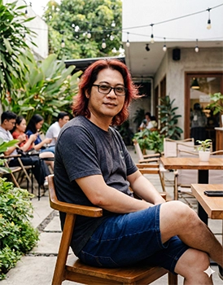

# 🌐 ALSYUNDAWY Professional Portfolio

<p align="center">
  
</p>

<h3 align="center">Harry Dertin Sutisna Alsyundawy</h3>
<p align="center"><strong>System Administrator · DNS & ISP Infrastructure Specialist · Mail & Virtualization Expert</strong></p>

<p align="center">
  <a href="https://github.com/alsyundawy"></a>
  <a href="https://github.com/alsyundawy/alsyundawy.github.io/stargazers"></a>
  <a href="https://github.com/alsyundawy/alsyundawy.github.io/network/members"></a>
  
</p>

---

## 📖 Deskripsi Proyek

Repository ini berisi kode sumber untuk website portofolio profesional satu halaman (single-page static site) milik **Harry Dertin Sutisna Alsyundawy**. Dibuat dengan mengutamakan performa tinggi, keamanan optimal, aksesibilitas modern, serta antarmuka yang bersih dan responsif baik di perangkat mobile maupun desktop.

Website ini memamerkan keahlian teknis tingkat lanjut di bidang administrasi sistem Linux, arsitektur DNS/RPZ Kominfo TrustPositif, infrastruktur ISP, klaster virtualisasi (Proxmox VE & VMware), integrasi SMTP/Mail server (Zimbra), serta diagnostik Looking Glass dan repositori open-source orisinal.

---

## ⚡ Fitur Utama & Hardening Sistem

Portfolio ini dikembangkan secara detail menggunakan optimasi arsitektur modern:

*   🚀 **Performa Scroll 60 FPS**: Event listener scroll dioptimalkan menggunakan teknik `requestAnimationFrame` dan caching DOM queries untuk mencegah kelambatan render saat bernavigasi antar bagian halaman.
*   🔒 **Subresource Integrity (SRI) & Keamanan CDN**: Pemuatan framework Bootstrap 5.3.8 dan Font Awesome v6.7.2 diperkuat dengan integritas hash (`integrity`) dan atribut `crossorigin` untuk memitigasi serangan tampering/hijacking CDN.
*   🌗 **Anti Flash of Light Theme (FOUC Prevention)**: Skrip inisialisasi tema ditempatkan secara inline langsung di bagian head dokumen. Ini menjamin transisi mode gelap/terang berlangsung instan sesuai preferensi perangkat sistem tanpa efek kedipan layar putih/terang di awal render.
*   🌐 **Favicon & Web App Manifest Lengkap**: Dilengkapi dengan konfigurasi aset ikon lengkap (ICO, SVG, PNG, Apple Touch Icon) beserta integrasi file manifest untuk pengalaman Progressive Web App (PWA) di perangkat mobile.
*   ⚡ **Cumulative Layout Shift (CLS) Reduction**: Gambar logo serta 61 daftar logo klien memiliki dimensi lebar (`width`) dan tinggi (`height`) eksplisit serta rasio aspek yang kokoh demi stabilitas pemuatan layout visual.
*   🔄 **Sistem Fallback Gambar Dinamis**: Didukung dengan event listener cerdas yang secara dinamis mengganti gambar logo klien dengan teks alternatif yang elegan apabila aset gambar gagal dimuat secara lokal.

---

## 🛠️ Tech Stack & Dependencies

| Komponen | Teknologi | Deskripsi |
| :--- | :--- | :--- |
| **Core Structure** | HTML5 | Struktur semantik standar SEO terbaik. |
| **Styling Engine** | Vanilla CSS (Minified) | Desain UI modern dengan variabel warna dinamis (HSL tokens) yang sudah di-minify. |
| **CSS Framework** | Bootstrap v5.3.8 | Grid layout responsif dan utilitas antarmuka. |
| **Typography & Icons** | Font Awesome Free 6.7.2 & Google Fonts | Ikon vektor premium dan font sistem keluarga Inter. |
| **Logic & Theme Switcher** | Vanilla JavaScript | Skrip interaktif, deteksi prefers-color-scheme perangkat, penanganan error fallback, dan intersection observer. |

---

## 📁 Struktur Direktori

```bash
├── index.html                   # Berkas HTML utama portofolio
├── Portofolio.webp              # Foto profil hero beresolusi tinggi (WebP)
├── alsyundawy-hero.webp         # Gambar latar belakang hero section
├── favicon.ico                  # Aset favicon klasik 
├── favicon.svg                  # Favicon modern berbasis vektor
├── favicon-16x16.png            # Favicon ukuran kecil
├── favicon-32x32.png            # Favicon ukuran sedang
├── apple-touch-icon.png         # Ikon untuk sistem iOS/Apple Devices
├── site.webmanifest             # Manifest konfigurasi aplikasi web
├── sitemap.xml                  # Peta situs untuk pengoptimalan SEO
└── xmg/                         # Direktori gambar logo klien & branding IT
```

---

## 💻 Cara Menjalankan Secara Lokal

Karena website ini adalah halaman statis murni, Anda tidak memerlukan server backend yang rumit untuk menjalankannya. Cukup klon repositori dan buka berkas `index.html`.

### 1. Menggunakan Browser Langsung
Klon repositori ini ke mesin lokal Anda, lalu klik dua kali pada berkas `index.html` untuk membukanya langsung di peramban web pilihan Anda:
```bash
git clone https://github.com/alsyundawy/alsyundawy.github.io.git
cd alsyundawy.github.io
# Buka index.html di browser Anda
```

### 2. Menggunakan Server Lokal Ringan (Direkomendasikan)
Untuk memastikan pemuatan modul manifest dan fitur keamanan peramban bekerja optimal seperti di server produksi, Anda bisa menggunakan modul HTTP server bawaan Python:
```bash
# Untuk pengguna Python 3.x
python3 -m http.server 8000
```
Buka peramban Anda dan kunjungi halaman: `http://localhost:8000`

---

## 📜 Lisensi & Hak Cipta

*   **Copyleft 2026 ALSYUNDAWY IT SOLUTION** - Kode sumber terbuka bagi siapa saja yang ingin berkreasi dan memanfaatkannya dengan tetap mencantumkan kredit pemilik asli.
