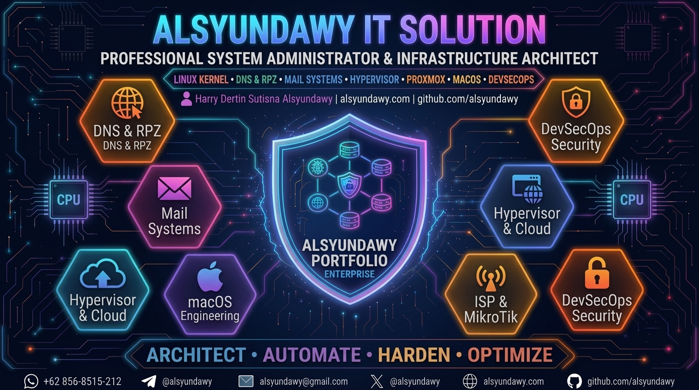

# ALSYUNDAWY IT SOLUTION

## System Administrator · DNS & ISP Infrastructure Specialist · Mail & Virtualization Architect

**Harry Dertin Sutisna Alsyundawy** · DKI Jakarta, Indonesia

---

## Overview

Portfolio profesional satu halaman yang menyajikan keahlian teknis tingkat lanjut (*advanced enterprise engineering*) dalam domain **System Administration**, **DNS/RPZ Architecture**, **Mail Server Hardening & Incident Response**, **Hypervisor & Cloud Virtualization**, **ISP Hardware & Network Automation**, serta **macOS & Apple Systems Engineering**.

Dibangun dengan fokus pada prinsip rekayasa sistem berkinerja tinggi:

- **Performa Ekstrem**: Sub-millisecond bootstrap (<1ms) pada runtime PHP 8.1+, rendering 60 FPS, CLS 0, dan zero external framework overhead.
- **DevSecOps & Keamanan**: Dynamic CSP Nonce, SHA-384 Subresource Integrity (SRI), COOP/CORP security headers, dan mitigasi menyeluruh OWASP Top 10:2025 serta CWE-22.
- **Responsif Lintas Perangkat**: Teruji pada 20 konfigurasi perangkat nyata dari resolusi VGA (640x480) hingga 2K (2560x1440) dan 4K, dilengkapi optimasi khusus viewport notch/punch-hole untuk Xiaomi Redmi, POCO (MIUI / HyperOS), dan iPhone.
- **Aksesibilitas & SEO**: Standar W3C WCAG 2.2 AA (kontras warna HSL, navigasi keyboard terstruktur) dan JSON-LD Schema.org terindeks penuh.

---

## Domain Keahlian Utama

- **DNS & RPZ Infrastructure**: PowerDNS Authoritative & Recursor, BIND9, Unbound, Response Policy Zones (RPZ), CDB, RTBH, integrasi otomatis TrustPositif Komdigi, DNS Anycast clustering.
- **Mail Server & Incident Response**: Zimbra Collaboration Suite (ZCS 8/9/10), Carbonio Community/Enterprise, Postfix, Dovecot, Proxmox Mail Gateway (PMG), sanitasi antrian spam, forensik malware, pemulihan ransomware.
- **Hypervisor & Virtualization**: Proxmox VE (PVE 7/8/9), VMware vSphere / ESXi (termasuk hardware tidak didukung & macOS Unlocker), KVM/QEMU, high-availability clustering, Ceph storage.
- **ISP Operations & Networking**: MikroTik RouterOS (scripting, BGP peering, firewall mangle, queue tree, automated IPset blacklisting), Cisco, FreeRADIUS, IPAM, Ookla Speedtest Server, BGP Looking Glass.
- **macOS & Apple Systems Engineering**: Subnet calculator native Swift & AppKit, bypass MDM SkipMDM, kustomisasi kernel/boot, optimasi developer macOS (Apple Silicon M1-M4 & Intel x64).
- **Linux Kernel & Security**: Debian, Ubuntu, Rocky Linux, AlmaLinux, defensive Bash scripting, kompilasi shell script via SHC, hardening sysctl/kernel, fail2ban, UFW, nftables.

---

## Showcase Repositori (40 Repositori Produksi)

### Original Creations (26 Repositories)

- **[PowerDNS-Admin-PHP](https://github.com/alsyundawy/PowerDNS-Admin-PHP)**: Enterprise Authoritative PowerDNS Web Control Plane dalam Native PHP & PDO tanpa external framework bloat. Dilengkapi sub-millisecond bootstrap (<1ms), zero-CDN offline capability, RFC 6238 TOTP 2FA, multi-server node clustering, APCu caching, dan PowerDNS HTTP API v1 integration.
- **[SubnetCalc-MacOS](https://github.com/alsyundawy/SubnetCalc-MacOS)**: Kalkulator subnet IPv4/IPv6 native Swift & AppKit Cocoa berkinerja tinggi untuk macOS Universal 2 (Apple Silicon M1-M4 & Intel x64). Dilengkapi 25 developer theme suite, kalkulasi CIDR/VLSM, netmask, wildcard mask, dan hierarchical menu navigation.
- **[SubNetCalc-Electron](https://github.com/alsyundawy/SubNetCalc-Electron)**: Kalkulator subnet IPv4/IPv6 desktop presisi tinggi dan hemat memori. Dibangun dengan Electron 44, Node 24, React 19, dan TypeScript; mendukung 14 multi-theme, klasifikasi RFC, visualisasi bit biner, dan kalkulasi CIDR real-time.
- **[ZCS Eradicate Malware Suite](https://github.com/alsyundawy/eradicate-zimbra-malware)**: Enterprise Forensic Incident Response, Anti-Ransomware & Zimbra Permission Healing Suite untuk pembersihan malware, webshell, dan injeksi crontab pada Zimbra Collaboration Server.
- **[Zimbra Link Installer & Archive](https://github.com/alsyundawy/Zimbra-Link-Installer)**: Enterprise ZCS binary archive, checksum index, CLI installer, dan CVE security dossier untuk deployment cepat Zimbra FOSS.
- **[TrustPositif To RPZ Binary](https://github.com/alsyundawy/TrustPositif-To-RPZ-Binary)**: Generator konversi database blacklist TrustPositif Kominfo ke format biner PowerDNS Response Policy Zone (RPZ) dengan optimasi performa tinggi.
- **[TrustPositif Database](https://github.com/alsyundawy/TrustPositif)**: Repositori database TrustPositif Kominfo terstandarisasi dengan sinkronisasi harian otomatis.
- **[TrustPositif Validator](https://github.com/alsyundawy/TrustPositif-Validator)**: Engine validasi domain multi-core dengan verifikasi sintaksis domain dan RFC compliance.
- **[MikroTik Script Automation](https://github.com/alsyundawy/MIKROTIK-SCRIPT)**: Kumpulan skrip otomatisasi tingkat lanjut untuk MikroTik RouterOS (failover, netwatch, auto-backup, dynamic DNS).
- **[MikroTik Blacklist](https://github.com/alsyundawy/mikrotik-blacklist)**: Sistem manajemen blacklist IP otomatis berbasis RouterOS Address-List untuk proteksi brute-force dan port scanning.
- **[ACL BIND9 Indonesia + OpenIXP](https://github.com/alsyundawy/bind-acl-indonesia-openixp)**: Generator Access Control List (ACL) IP alokasi Indonesia dan OpenIXP untuk mengamankan rekursi BIND9 DNS Server.
- **[UFW Ipset Blocklist Auto Update](https://github.com/alsyundawy/ufw-ipset-blocklist-autoupdate)**: Otomatisasi pemblokiran jutaan IP berbahaya pada Linux firewall menggunakan IPset dan UFW berkinerja tinggi.
- **[PowerDNS Zone Backups](https://github.com/alsyundawy/PowerDNS-Zone-Backups)**: Skrip backup otomatis zone file PowerDNS MySQL/PostgreSQL backend dengan enkripsi dan rotasi incremental.
- **[SkipMDM macOS Bypass](https://github.com/alsyundawy/skipmdm-bypass)**: Tool manajemen dan bypass profil Mobile Device Management (MDM) pada macOS Monterey, Ventura, Sonoma, dan Sequoia.
- **[PHP File & Directory Browser](https://github.com/alsyundawy/File-Directory-Browser)**: File manager dan directory browser web native PHP aman tanpa dependensi eksternal, dilengkapi CSRF protection dan sanitasi path traversal.
- **[Zimbra Clean Spam](https://github.com/alsyundawy/Zimbra-Clean-Spam)**: Utilitas pembersihan antrian spam (deferred & incoming mail queue) pada Zimbra Postfix MTA secara otomatis.
- **[Bash Script Uninstall Zimbra](https://github.com/alsyundawy/uninstall-zimbra)**: Skrip pembersihan tuntas instalasi Zimbra, database MariaDB/OpenLDAP, dan residu direktori hingga ke akar sistem.
- **[Z2C Migration](https://github.com/alsyundawy/Z2C)**: Engine migrasi data mailbox lengkap dari Zimbra Collaboration ke Carbonio Community Edition.
- **[PHP-PDNSManager](https://github.com/alsyundawy/PHP-PDNSManager)**: Enterprise DNS Management Web GUI & REST API Gateway untuk PowerDNS dengan autentikasi multi-user dan audit logging.
- **[bailu-kilo-agent](https://github.com/alsyundawy/bailu-kilo-agent)**: Ekstensi sidebar agentic coding untuk BAILU AI, VS Code, dan Code-OSS forks.
- **[PHP-BindManager](https://github.com/alsyundawy/PHP-BindManager)**: Web GUI manajemen BIND9 DNS Server modern berbasis PHP 8.4+ dan REST API.
- **[Disable-MacOS-Updates](https://github.com/alsyundawy/Disable-MacOS-Updates)**: Kumpulan skrip Bash reversibel untuk kontrol penuh pembaruan otomatis sistem operasi macOS.
- **[PNetLab v8](https://github.com/alsyundawy/PnetLab-v8)**: Platform emulasi dan virtualisasi jaringan enterprise berbasis Ubuntu 26.04.
- **[Nginx-Reverse-Proxy-Cluster](https://github.com/alsyundawy/nginx-reverse-proxy-cluster)**: Arsitektur load balancing dan reverse proxy cluster Nginx dengan SSL termination dan rate limiting.
- **[ISP-Billing-Radius](https://github.com/alsyundawy/isp-billing-radius)**: Modul integrasi sistem penagihan ISP berbasis FreeRADIUS dan MikroTik API.
- **[macOS-Pro-Tweaks](https://github.com/alsyundawy/macos-pro-tweaks)**: Otomatisasi konfigurasi lingkungan pengembangan dan system tuning untuk macOS.

### Maintained Specialized Forks (14 Repositories)

- **[Visual Subnet Calculator](https://github.com/alsyundawy/visualsubnetcalc)**: Kalkulator subnet visual dan perencana hierarki CIDR/IP interaktif.
- **[macOS Unlocker v4 for VMware ESXi](https://github.com/alsyundawy/esxi-unlocker-v4)**: Utilitas patch VMware ESXi untuk memungkinkan instalasi dan eksekusi guest OS macOS pada server x86.
- **[ZMBackup Enterprise Suite](https://github.com/alsyundawy/zmbackup)**: Multi-threaded hot backup, restore, dan disaster recovery suite untuk Zimbra Collaboration.
- **[Zimbra to Zimbra Migration Tool (Z2Z)](https://github.com/alsyundawy/Zimbra2Zimbra-Migration-Tool)**: Migration engine enterprise lintas server Zimbra tanpa downtime pengguna.
- **[The Best Blocklist Collection](https://github.com/alsyundawy/Sefinek-Blocklist-Collection)**: Koleksi komprehensif 100+ sumber blocklist dengan 5+ juta domain berbahaya.
- **[Hagezi DNS Blocklists](https://github.com/alsyundawy/dns-blocklists)**: Feed filtering DNS terstruktur untuk Pi-hole, AdGuard Home, dan Unbound.
- **[DNS Performance Test](https://github.com/alsyundawy/dnsperftest)**: Benchmarking latensi dan throughput DNS resolver lokal serta publik dengan reporting detail.
- **[Microsoft Office for macOS](https://github.com/alsyundawy/Microsoft-Office-For-MacOS)**: Installer Office macOS Universal 2 (Apple Silicon & Intel) terverifikasi ⭐ 5.9k.
- **[Generic Shell Script Compiler (SHC)](https://github.com/alsyundawy/shc)**: Kompiler shell script Bash/POSIX ke binary executable terenkripsi RC4.
- **[NotepadNext for macOS](https://github.com/alsyundawy/NotepadNext-MacOS)**: Reimplementasi Notepad++ modern berbasis Qt6 untuk macOS.
- **[Xiaomi ADB & Fastboot Tools](https://github.com/alsyundawy/XiaomiADBFastbootTools-Win32)**: Toolkit diagnostik perangkat Android Xiaomi MIUI / HyperOS.
- **[OpenVPN Road Warrior Installer](https://github.com/alsyundawy/OpenVPN-Install)**: Skrip instalasi cepat OpenVPN dual-stack IPv4/IPv6 dengan resolver Unbound.
- **[OpenSSL 1.0.2 Hardened Fork](https://github.com/alsyundawy/openssl-1.0.2)**: Fork OpenSSL 1.0.2 dengan backport mitigasi CVE keamanan untuk sistem legacy enterprise.
- **[Pear Desktop Mac](https://github.com/alsyundawy/pear-desktop-mac)**: Aplikasi desktop pemutar YouTube Music untuk macOS dengan fitur ad-blocking bawaan.

---

## Alat Jaringan & Diagnostik Mandiri (13 Telemetry Tools)

Suite perangkat diagnostik jaringan, telemetri DNS, dan utilitas ISP yang dihosting mandiri untuk monitoring produksi:

| Nama Tool | URL Akses | Fungsi & Spesifikasi Teknis |
| :--- | :--- | :--- |
| **Looking Glass** | [lg.alsyundawy.com](https://lg.alsyundawy.com) | BGP Route Telemetry, Ping, MTR & Traceroute multi-protocol |
| **Looking Glass v2.0** | [lg.alsyundawy.com/lg.php](https://lg.alsyundawy.com/lg.php) | Engine Looking Glass v2.0 berkinerja tinggi |
| **Looking Glass v2.1** | [lg.alsyundawy.com/lgv1.php](https://lg.alsyundawy.com/lgv1.php) | Engine Looking Glass v2.1 dengan optimasi throughput |
| **Looking Glass v2.5** | [lg.alsyundawy.com/lgv2.php](https://lg.alsyundawy.com/lgv2.php) | Engine Looking Glass v2.5 dengan respons real-time |
| **Looking Glass GitHub** | [lg.alsyundawy.com/lg-github.php](https://lg.alsyundawy.com/lg-github.php) | Telemetri jaringan terintegrasi repositori GitHub |
| **MultiPing Location** | [lg.alsyundawy.com/multiping.php](https://lg.alsyundawy.com/multiping.php) | Uji latensi simultan ke berbagai titik data center |
| **Open DNS Scanner** | [lg.alsyundawy.com/resolver.php](https://lg.alsyundawy.com/resolver.php) | Pemindai dan audit kerentanan Open DNS Resolver |
| **SpeedTest Server** | [speedtest.alsyundawy.com](https://speedtest.alsyundawy.com/) | Server benchmark bandwidth dan latensi dual-stack |
| **RBL Checker** | [rbl.alsyundawy.com](https://rbl.alsyundawy.com/) | Multi-DNSBL real-time IP reputation and blacklist checker |
| **TrustPositif Check** | [trustcheck.alsyundawy.com](https://trustcheck.alsyundawy.com/) | Verifikasi status domain pada database TrustPositif Kominfo |
| **DNS CHECKER** | [dnschecker.alsyundawy.com](https://dnschecker.alsyundawy.com/) | Propagasi DNS global dan query record resolusi |
| **Repository Mirror** | [repo.alsyundawy.com](https://repo.alsyundawy.com/) | Arsip paket biner dan repositori instalasi mandiri |
| **Visual Subnet Calculator** | [alsyundawy.com/subnet](https://alsyundawy.com/subnet/) | Kalkulator subnet interaktif CIDR/VLSM IPv4 & IPv6 |

---

## Tutorial & Panduan Teknis (18 Panduan Infrastruktur)

Panduan deployment dan administrasi sistem tingkat enterprise:

| Judul Panduan | Sistem Target | Lingkup Materi & Arsitektur |
| :--- | :--- | :--- |
| **[Build Zimbra FOSS](https://alsyundawy.com/Build-Zimbra-FOSS.html)** | Ubuntu / RHEL | Kompilasi source code Zimbra Collaboration dari repositori Git |
| **[Install Zimbra FOSS](https://alsyundawy.com/Install-Zimbra-FOSS.html)** | Ubuntu 20.04 / Rocky 8 | Panduan deployment production mail server dengan DNS split-horizon |
| **[Install & Deploy PNETLab v8](https://alsyundawy.com/PNETLab-v8.html)** | Ubuntu 26.04 | Instalasi dan setup virtualisasi lab jaringan PNETLab v8 |
| **[Install & Deploy PNETLab Klasik](https://alsyundawy.com/PNETLab-v4.html)** | Ubuntu 18.04 / 20.04 | Panduan setup PNETLab versi v4, v5, dan v6 |
| **[Cacti Monitoring Stack](https://alsyundawy.com/Cacti.html)** | Debian GNU/Linux | Setup network graphing, SNMP polling, dan RRDtool |
| **[HyperGlass](https://alsyundawy.com/HyperGlass.html)** | Python 3 / Linux | Deployment BGP Looking Glass modern dengan REST API |
| **[Ookla Speedtest Server](https://alsyundawy.com/Ookla-Speedtest.html)** | Debian / Ubuntu | Konfigurasi host resmi server Ookla Speedtest dual-stack |
| **[OpenVPN Road Warrior](https://alsyundawy.com/OpenVPN-Install.html)** | Linux | Setup VPN aman dengan enkripsi TLS dan resolver Unbound |
| **[PHP PowerAdmin](https://alsyundawy.com/PowerAdmin.html)** | Debian / Ubuntu | Manajemen PowerDNS Authoritative via web GUI |
| **[PHP-LookingGlass](https://alsyundawy.com/PHP-LookingGlass.html)** | Native PHP | Alat diagnostik jaringan ringan single-file |
| **[phpIPAM](https://alsyundawy.com/phpIPAM.html)** | Linux / Apache | Manajemen alokasi IP Address, VLAN, dan VRF |
| **[PowerDNS-Admin Debian](https://alsyundawy.com/PowerDNS-Admin-Debian.html)** | Debian GNU/Linux | Setup kluster PowerDNS Master-Slave dengan MariaDB |
| **[PowerDNS-Admin Ubuntu](https://alsyundawy.com/PowerDNS-Admin-Ubuntu.html)** | Ubuntu Server | Integrasi PowerDNS API dengan backend Flask/Python |
| **[Prometheus & Grafana](https://alsyundawy.com/Prometheus-Grafana-Debian.html)** | Debian GNU/Linux | Setup metrics exporter, alerting, dan dashboard visual |
| **[Proxmox VE 9](https://alsyundawy.com/Proxmox-VE-9.html)** | Bare-metal | Instalasi hypervisor Proxmox VE 9, SDN, dan ZFS storage pool |
| **[TrustPositif RPZ Install](https://alsyundawy.com/TrustPositif-RPZ-Install.html)** | BIND9 / Linux | Implementasi filtering DNS RPZ dengan feed TrustPositif |
| **[vSphere Unsupported HW](https://alsyundawy.com/vSphere.html)** | VMware ESXi | Instalasi VMware ESXi pada CPU dan NIC yang tidak bersertifikasi |
| **[WalkieFleet Server](https://alsyundawy.com/WalkieFleet.html)** | Debian / Ubuntu | Setup server Push-to-Talk (PTT) untuk komunikasi radio over IP |

---

## Arsitektur Keamanan & Standar Kualitas (13 Pilar Review)

Portofolio ini diaudit secara mendalam mengacu pada **OWASP Top 10:2025**, **CWE Top 25**, serta prinsip rekayasa sistem Linux:

1. **Strict Content-Security-Policy (CSP)**: Nonce kriptografis acak per request dengan fallback OpenSSL strong entropy dan timer nanodetik SHA-256 (`random_bytes(16) -> openssl_random_pseudo_bytes(16, $is_strong) -> hash('sha256', hrtime() ...)`), 100% bebas dari weak hash (`md5`) dan weak PRNG (`mt_rand`).
2. **Subresource Integrity (SRI)**: Seluruh stylesheet dan script eksternal diamankan dengan SHA-384 cryptographic integrity hash.
3. **Cross-Origin Isolation**: Dilengkapi header `Cross-Origin-Opener-Policy: same-origin` dan `Cross-Origin-Resource-Policy: same-origin`.
4. **Hardware Safe-Area Inset Handling**: Padding dinamis menggunakan `env(safe-area-inset-*)` mencegah pemotongan konten pada layar bertakik (*notch*) dan *punch-hole* kamera.
5. **Anti-Font Boosting**: Mengunci penskalaan teks Android WebKit via `-webkit-text-size-adjust: 100%; -moz-text-size-adjust: 100%; text-size-adjust: 100%;` untuk mencegah card melebar ke kanan pada Xiaomi Redmi MIUI dan POCO HyperOS.
6. **Zero Horizontal Overflow**: Terverifikasi melalui suite pengujian otomatis Playwright pada 20 perangkat nyata dengan overflow 0 pixel.

---

## Verifikasi Linter & Toolchain (0 Errors)

| Tool Linter | Standar Kualitas | Hasil Verifikasi | Status |
| :--- | :--- | :--- | :--- |
| **PHP Syntax (`php -l`)** | AST Syntax Check | `No syntax errors detected` | **PASSED (0 Errors)** |
| **PHP_CodeSniffer (`phpcs`)** | PSR-12 Standard | `0 errors, 0 warnings` | **PASSED (Clean)** |
| **PHPStan** | Level Max (Level 9) | `[OK] No errors` | **PASSED (Clean)** |
| **Psalm** | Strict Type Check | `No errors found! Inferred: 99.63%` | **PASSED (Clean)** |
| **PHP-CS-Fixer** | Rule `@PSR12` | `Found 0 of 1 files that can be fixed` | **PASSED (Clean)** |
| **ESLint** | Flat Config Standard | `0 errors, 0 warnings` | **PASSED (Clean)** |
| **Stylelint** | CSS Standard | `0 errors, 0 warnings` | **PASSED (Clean)** |
| **Markdownlint** | Markdown Quality | `0 errors, 0 warnings` | **PASSED (Clean)** |
| **Playwright E2E** | 20 Device Viewports | `20/20 Devices 0px Overflow` | **PASSED (100%)** |

---

## Klien & Mitra Industri

Dipercaya oleh **56+ penyedia jasa internet (ISP), operator jaringan, dan enterprise** di Indonesia dalam penanganan DNS, routing BGP, virtualisasi, dan pemulihan insiden sistem email.

[Lihat portofolio klien selengkapnya →](https://alsyundawy.github.io/#clients)

---

## Tautan Resmi & Profil Kontak

| Media / Platform | Tautan | Keterangan |
| :--- | :--- | :--- |
| **Website Resmi** | [https://alsyundawy.com](https://alsyundawy.com) | Portal utama Alsyundawy IT Solution |
| **GitHub** | [https://github.com/alsyundawy](https://github.com/alsyundawy) | Repositori proyek & kontribusi open-source |
| **Portfolio Online** | [https://alsyundawy.github.io](https://alsyundawy.github.io) | Halaman portofolio live v8.5.5 |
| **Email** | [alsyundawy@gmail.com](mailto:alsyundawy@gmail.com) | Komunikasi bisnis & konsultasi teknis |
| **WhatsApp** | [+62 856-5851-5212](https://wa.me/6285658515212) | Kontak instan WhatsApp |
| **Telegram** | [@alsyundawy](https://t.me/alsyundawy) | Direct channel Telegram |
| **YouTube** | [@alsyundawy](https://youtube.com/@alsyundawy) | Kanal tutorial dan dokumentasi teknis |
| **LinkedIn / X** | [@Alsyundawy](https://x.com/Alsyundawy) | Pembaruan proyek & jejaring profesional |
| **Donasi / Dukungan** | [paypal.me/alsyundawy](https://www.paypal.me/alsyundawy) | Dukungan pengembangan open-source |

---

## License

Copyleft (c) 2026 **ALSYUNDAWY IT SOLUTION** (Harry Dertin Sutisna).

Kode sumber dan arsitektur ini terbuka bagi siapa saja yang ingin berkreasi, memodifikasi, dan memanfaatkannya dengan tetap mencantumkan atribusi kredit pemilik asli.

---

[⬆ Kembali ke Atas](#alsyundawy-it-solution)
